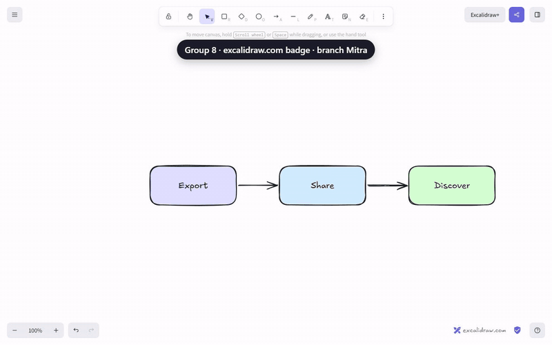
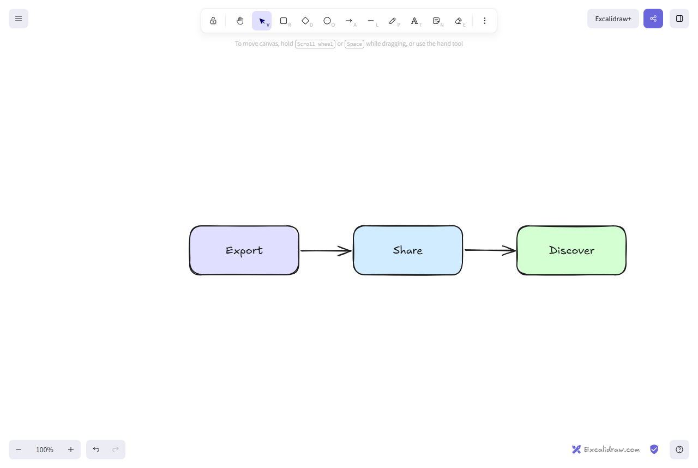
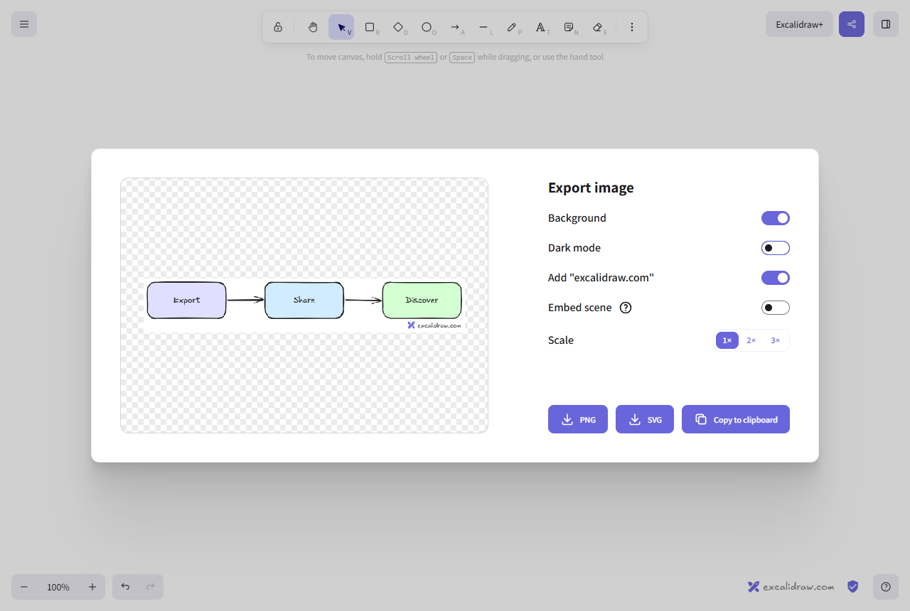
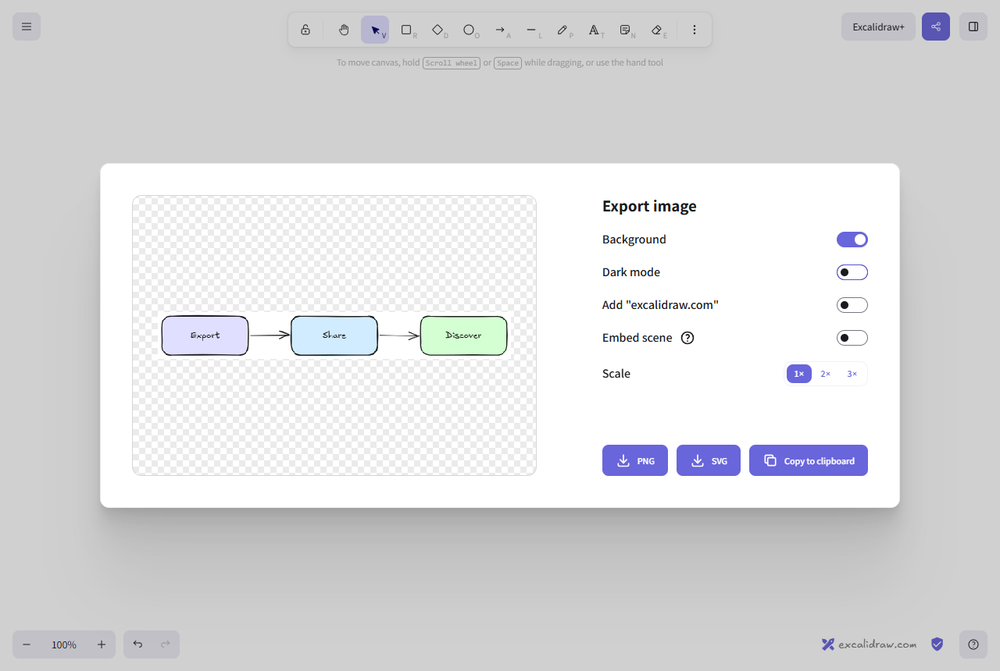
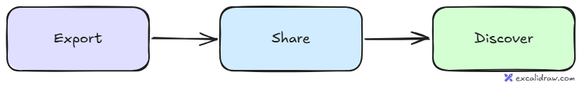
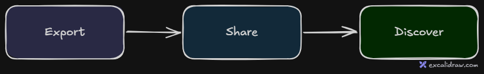
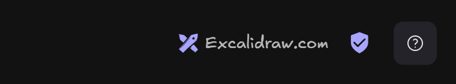
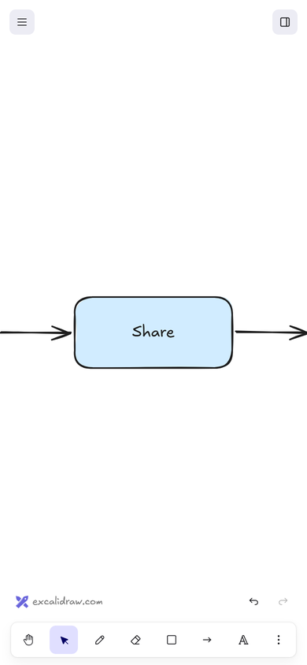
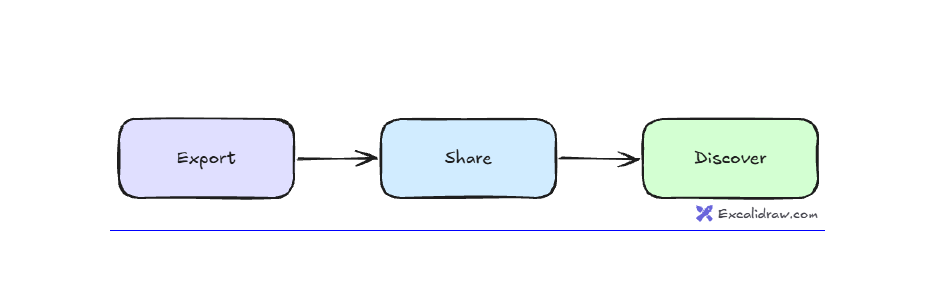

# Excalidraw.com badge

Group 8 (Mitra Kermanian, Adedoyin Ahoton, Bertrand Cius, Jimmy Ong, Christian Douka) · branch `Mitra` · September 21, 2026

Built from our [PRD](https://docs.google.com/document/d/1rL5RdZMQbKbBUnGbWUuceDsuuRutfZGiX5hzWvQI3TA/edit) for Avni Nahar, Head of Marketing. Visual write-ups (ask Mitra for access): [Excalidraw.com Badge Build](https://claude.ai/artifact/NidnBVNnrCaRxJY5Hx3Jok) and the [Badge Test Kit](https://claude.ai/artifact/V9Ka2AbBHs6CvDgRREB8AP).



Sharper version: [`excalidraw-badge-demo.mp4`](excalidraw-badge-demo.mp4).

## What it does

- **Every image export carries a small badge**: the Excalidraw logo and "excalidraw.com", bottom-right, below the drawing so it never covers a shape. PNG, SVG and all three clipboard copies.
- **The whiteboard shows the same badge, always on**, bottom-right next to the encryption icon. It opens the Excalidraw it runs on in a new tab: excalidraw.com in production, your local or preview build while testing.
- **Phones get it too**: on the left of the row above the toolbar (undo and redo are on the right). It steps aside while that row shows style buttons, and sits in the bottom-left corner in view mode.
- **One switch removes it from exports**: Give Excalidraw a nod in the Export image window (with a “?” that explains the badge). On by default on excalidraw.com, off by default for apps that use the npm package, remembered in the browser.
- **Copies can be clickable**: with the badge on, Copy to clipboard also copies a linked version of the image. Word pastes it as a clickable image.
- **Every export is measured**: right-click and Shift+Alt+C copies now count as exports, and every export records `attribution:on` or `attribution:off`.



| Switch on (default) | Switch off |
| --- | --- |
|  |  |

Exported PNG, light and dark mode:





| Corner badge in dark theme | On a phone |
| --- | --- |
|  |  |

[`example-export.svg`](example-export.svg) is a real SVG export. Open it in a browser and click the badge: it links to `https://excalidraw.com/?utm_source=excalidraw&utm_medium=export&utm_content=svg#new` (a new blank board, not the last local drawing).

## Where a click works

| Where the badge appears | Clickable | Why |
| --- | --- | --- |
| The whiteboard corner (desktop and phone) | Yes | A normal link, opens in a new tab. |
| SVG file, or Copy to clipboard as SVG | Yes | SVG can hold links (opened in a browser or inside a page). |
| SVG shown as a picture, for example in a GitHub README | No | Browsers turn links off inside images shown this way. |
| PNG file | No | A PNG is only pixels. The readable address does the job. |
| Copied image pasted into Word | Yes | Word keeps the linked version: the picture is the link. |
| Copied image pasted into Google Docs | No | Docs pastes the picture but drops links on pasted images. |
| Copied image pasted into picture-only apps | No | They take the PNG, exactly as before. |

## Paste tests (September 21, 2026)

Copied from our build in Chrome with a real click on Copy to clipboard, then:

- **Windows clipboard** held the PNG, a bitmap, and the linked HTML version (`<a href="…utm_content=clipboard">`), sized at 1×.
- **Word**: one image, and the image itself links to excalidraw.com. Word draws a thin blue link line under it; Chrome strips the style that would hide it.
- **Google Docs**: the image pasted normally; the link was dropped by Docs. No broken image.
- **Not tested**: Gmail and Slack (pasting there risks sending a message). Both still receive the PNG.



## Tracking

| What someone does | Event | Label example |
| --- | --- | --- |
| PNG, SVG or Copy from the Export window | `export` · `png` / `svg` / `clipboard` | `ui \| attribution:on` |
| Right-click, Copy to clipboard as PNG or SVG | `export` · `copyAsPng` / `copyAsSvg` | `contextMenu (desktop) \| attribution:on` |
| Shift+Alt+C | `export` · `copyAsPng` | `keyboard (desktop) \| attribution:off` |
| Turn the badge switch on or off | `export` · `toggleAttribution` | `ui (desktop) \| attribution:off` |

Brand Visibility Rate = exports labelled `attribution:on` ÷ all exports, per format. Target: at least 50% in every format within three months. Visits from the corner badge carry `utm_content=canvasBadge`; visits from exports carry `utm_medium=export`.

## Where the badge never appears

The export badge is an option an export has to ask for directly; it is never read from the editor's settings. So it can't leak into library thumbnails and previews, images the AI feature makes, the Publish Library window, or other apps built with the npm package. A test checks this. The corner badge lives only in the excalidraw.com app.

## PRD P2 items

- **Smaller badge for very small exports**: the default mark is already logo + `excalidraw.com`. If that would still be wider than the drawing, the export is widened so the badge stays below the content.
- **Badge test with real creators and viewers**: protocol in [`comparison-test.md`](comparison-test.md). Three versions (none, text only, logo + copy). Not a third Export-window toggle. The [Badge Test Kit](https://claude.ai/artifact/V9Ka2AbBHs6CvDgRREB8AP) has the live click test and results sheet.

## Try it

```bash
yarn
yarn start
```

Open http://localhost:3001, draw something, and open the Export image window (Ctrl+Shift+E).

## Main files

- `packages/excalidraw/scene/exportAttribution.ts`: draws the badge and builds the SVG link
- `packages/excalidraw/scene/export.ts`: makes room for the badge in PNG and SVG exports
- `packages/excalidraw/clipboard.ts`: copies the linked version of the image
- `packages/excalidraw/components/ImageExportDialog.tsx`: the switch and live preview
- `excalidraw-app/components/ExcalidrawComBadge.tsx`: the corner badge and the phone badge
- `excalidraw-app/data/localStorage.ts`: on by default for excalidraw.com
- `packages/excalidraw/actions/actionClipboard.tsx`: copies count as exports
- Tests: `packages/excalidraw/tests/scene/exportAttribution.test.ts`, `excalidraw-app/tests/AppFooter.test.tsx`
- Comparison protocol: `docs/export-badge/comparison-test.md`

## Checks

- 16 badge tests (export badge, clipboard link and fallback, tracking, corner badge, phone badge); the full suite passes (2,213 tests, 137 files)
- Type check, lint and formatting clean
- Checked in the real app, on desktop and phone sizes, and paste-tested in Word and Google Docs

## Still open

- Run the creator and viewer sessions with the test kit
